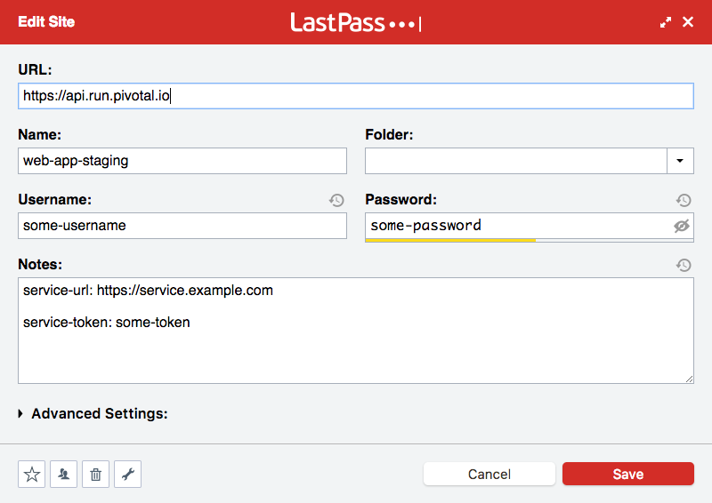
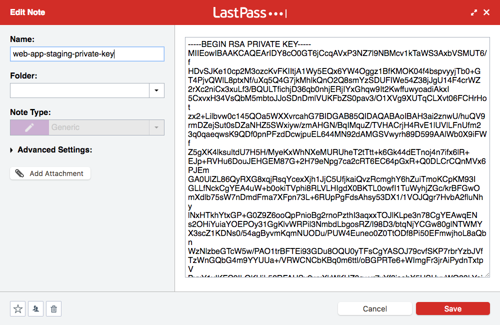

# reconfigure-pipeline

reconfigure-pipeline is a command-line tool that streamlines the process of pulling credentials from [LastPass](http://lastpass.com/) into a [Concourse](https://concourse.ci/) pipeline. It uses the [LastPass CLI](https://github.com/lastpass/lastpass-cli) to read credentials from LastPass, writes these credentials to a [named pipe](https://en.wikipedia.org/wiki/Named_pipe), and calls [fly](https://concourse.ci/fly-cli.html) with the named pipe as an argument, ensuring credentials are never written to disk.

## Motivation

[The Github incident in October 2016](https://github.com/blog/2273-incident-report-inadvertent-private-repository-disclosure) that allowed cloning private repos belonging to other users demonstrated the dangers of keeping credentials in git repositories. For this reason, many teams created tooling, usually in the form of shell scripts, that pulls credentials from LastPass using the LastPass CLI and feeds them into fly or [BOSH](https://bosh.io/).

Some of these tools work by storing the entire pipeline, or every credential in a pipeline, in one or a few notes in LastPass. Not only does this lead to unnecessary overhead in maintaining these complex YAML documents using an editor that wasn't built for this purpose, but it also discourages good credential hygiene.

reconfigure-pipeline was built to avoid duplication of work while ensuring the security of credentials. It encourages using the appropriate types in LastPass, while preserving backwards compatibility with tooling that is in use today.

## Installation

### Prerequisites

To use reconfigure-pipeline, you need to have the LastPass CLI and fly installed on your system and in your `PATH`.

### Binary Releases

The latest binary release for macOS and Linux can be found [here](https://github.com/pivotal-cf/reconfigure-pipeline/releases).

### Installing From Source

```
go get -u github.com/pivotal-cf/reconfigure-pipeline
```

## Usage

```
reconfigure-pipeline --target my-target --pipeline my-pipeline --config my-pipeline.yml
```

Where `my-target` is the name of a fly target and `my-pipeline` is the name of the pipeline you wish to reconfigure.

## Syntax

reconfigure-pipeline uses the same syntax as the [new BOSH CLI](https://bosh.io/docs/cli-v2.html) for credential interpolation, with a few LastPass-specific extensions.

Basic syntax in a pipeline looks like:

```yaml
key: ((credential-name/field/inner-key))
```

Where `credential-name` is the name of a credential in LastPass, field is a valid LastPass field name (see below), and the inner-key is an optional hash key that denotes the value stored in LastPass should be parsed as a YAML document, most commonly used with the Notes field.

### Fields

LastPass items have a variety of different fields, depending on the item type. Some of the most commonly used fields are:

* Username
* Password
* URL
* Notes
* Hostname
* Port
* Public Key
* Private Key
* Passphrase

You can see what fields are available on a particular item by running `lpass show item-name`

### Sample Pipeline

```yaml
---
resources:
- name: web-app
  type: git
  source:
    uri: git@github.com/pivotal-cf/web-app.git

- name: web-app-staging
  type: cf
  source:
    api: ((web-app-staging/URL))
    username: ((web-app-staging/Username))
    password: ((web-app-staging/Password))
    organization: some-org
    space: some-space

jobs:
- name: job-deploy-app
  plan:
  - get: web-app
  - put: web-app-staging
    params:
      manifest: web-app/manifest.yml
      environment_variables:
        PRIVATE_KEY: ((web-app-staging-private-key/Notes))
        SERVICE_URL: ((web-app-staging/Notes/service-url))
        SERVICE_TOKEN: ((web-app-staging/Notes/service-token))
```

Where the credentials in LastPass look like:




